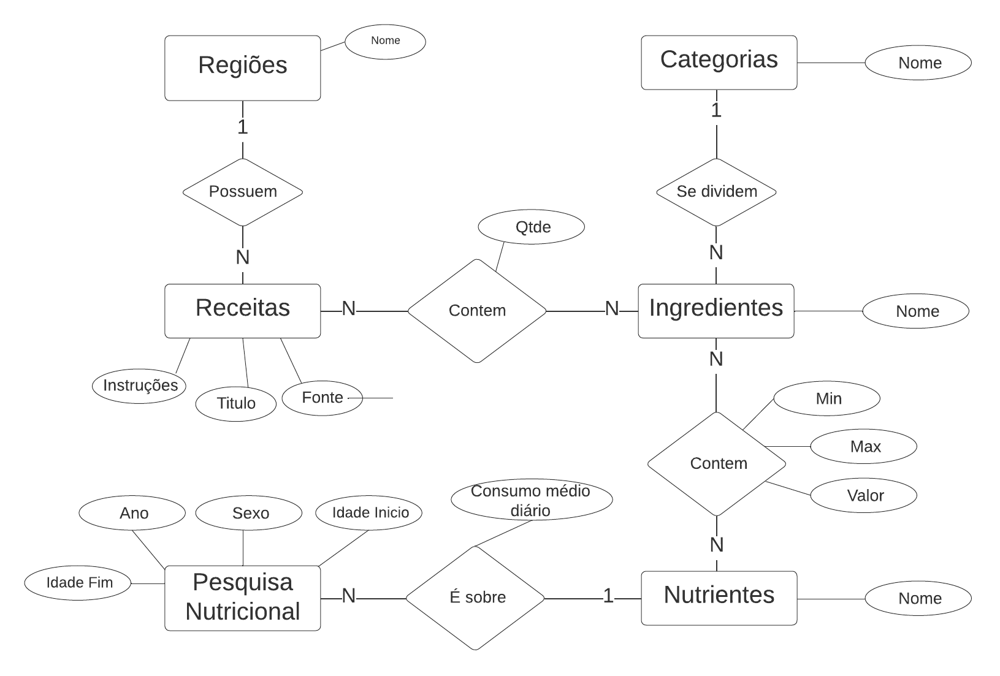

## Slides da Apresentação

[Link](https://github.com/MrRay0708/Projeto-MC536/blob/main/project-1/Apresenta%C3%A7%C3%A3o.pdf) da apresentação em pdf

## Motivação e Contexto

O intuito é obter um perfil nutricional de cada nação relacionando suas receitas, ingredientes e composições obtidos a partir das bases selecionadas. Assim, em uma análise maior e mais aprofundada, sendo possível conduzir maiores projetos, como por exemplo, um estudo sobre a saúde geral de cada país e os perfis de consumo.

## Bases de Dados

Título da base | Link | Breve descrição
----- | ----- | -----
FoodDB | [link](https://www.foodb.ca/) | Uma base com diversos alimentos e suas composições tanto quimicas como com relação aos nutrientes encotrados em cada alimento
TheMealDB | [link](https://www.themealdb.com/) | Uma base com diversas receitas e seus ingredientes, relacionando elas com seus países/regiões de origem
CulinaryDB | [link](https://cosylab.iiitd.edu.in/culinarydb/) | Uma outra base com receitas, ingredientes e suas regiões, vamos usar para complementar e comparar com a base de cima
NHANES Select Mean Dietary Intake Estimates | [link](https://data.cdc.gov/NCHS/NHANES-Select-Mean-Dietary-Intake-Estimates/8wmh-yzz9) | Uma base com diversas pesquisas feitas ao longo do tempo sobre o consudo de determinados nutrientes em diversas faixas etárias e etnias
The Nutritional Content of Food | [link](https://www.kaggle.com/datasets/thedevastator/the-nutritional-content-of-food-a-comprehensive) | Uma outra base com diversos ingredientes e seus perfis nutricionais detalhados com as unidades de medida

## Perguntas de Pesquisa/Análise

#### Pergunta/Análise 1
> * Quais os nutrientes mais consumidos em cada país?
>   
>   * A ideia aqui é fazer uma relação entre as receitas de cada país e os nutrientes que mais aparecem nessas receitas, entendendo um pouco do perfil nutricional de cada pais

> * Quais os ingredientes que compõe determinadas receitas?
>   
>   * Mapear o relacionamento entre receitas e ingredientes

> * Quais os ingredientes mais consumidos? E em cada país?
>   
>   * A partir das receitas identificar os ingredientes mais típicos de cada país e de maneira geral

> * Em qual período de tempo determinado nutriente foi menos consumido?
>   
>   * Aqui a ideia é endenteder, com base em um período de anos, qual foi o nutriente menos consumido, talvez também tentando fazer uma relação com a faixa etária

> * Quais são as receitas que não são adequadas para pessoas que não podem consumir glúten? 
>   
>   * A ideia é, com base nos valores nutricionais dos ingredientes das receitas, entender quais receitas não seriam recomendadas para pessoas que não podem consumir glúten

### Perguntas/Análise Propostas mas Não Implementadas

#### Pergunta/Análise 1
> * Dado determinado período de anos, quais foram os alimententos menos consumidos?
>   
>   * Com base no período de anos, conseguimos analisar quais os nutrientes menos consulmidos e comn essa informação ver quais alimentos/receitas tem esses nutrientes, entendendo quais são os alimentos que possivelmente foram menos consulmidos dentro desse período de anos.

## Modelo Conceitual

## Modelos Lógicos

~~~
Categoria(_id_, nome)

Regiao(_id_, nome)

Receita(_id_, titulo, fonte, instrucoes, regiao_id)
  regiao_id chave estrangeira -> Regiao(id)

Ingrediente(_id_, nome, categoria_id)
  categoria_id chave estrangeira -> Categoria(id)

ReceitaIngrediente(_receita_id_, _ingrediente_id_, qtde)
  _receita_id_ chave estrangeira -> Receita(id)
  _ingrediente_id_ chave estrangeira -> Ingrediente(id)

Nutriente(_id_, nome)

IngredienteNutriente(_ingrediente_id_, _nutriente_id_, valor, min, max)
  _ingrediente_id_ chave estrangeira -> Ingrediente(id)
  _nutriente_id_ chave estrangeira -> Nutriente(id)

PesquisaNutricional(_id_, ano, sexo, idade_inicio, idade_fim)

NutrientePesquisa(_id_, nutriente_id, pesquisa_id, consumo_medio_diario)
  pesquisa_id chave estrangeira -> PesquisaNutricional(id)
  nutriente_id chave estrangeira -> Nutriente(id)
~~~
